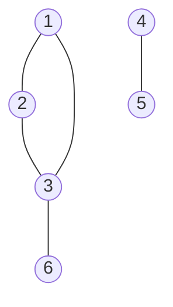

# 深さ優先探査

## 概要

深さ優先探索とは，グラフ上を全探索する方法のうちの1つです．

ただしここで言うグラフとはグラフ理論のグラフです．

## グラフとは

「そもそもグラフってなに？」という人も多いと思います．

(グラフ理論の)グラフとは「頂点」とそれらを結ぶ「辺」からなる構造です。

競技プログラミングではこのような構造において最短経路を求めたり，任意の頂点からまた別の頂点に辿り着けるかという問題がよく出ます。

このような問題を解決出来るのが今回解説するDFSなどです。

## 深さ優先探索の仕組み

深さ優先探索は次のような手順で探索していきます．

1. 今見ている頂点から進めるだけ進む
2. 突き当たりまで辿り着いたら１つ戻る
3. 進める頂点に進む
4. 1に戻る

DFSはこの手順を見たことがない頂点が無くなるまでor進めるところが完全に無くなるまで繰り返すことで探索します．

各頂点を調べること自体は1回ずつしか行わないため，計算量はO(V) (ただしVは頂点数)です．

## 深さ優先探索の実装方法

実装には再帰関数を用いるものと、スタックを使うものの2種類あります。

それぞれ得意不得意がありますが、再帰関数を用いた方法の方がよく見るような気がするので、ここでは再帰関数を用いて実装します。(スタックを用いた実装についてはBFSの回で少し触れます)

次の問題を解いてみます。

[問題文](https://hackmd.io/@kcctkyopro/BkeWngHss)

# DFS

実行時間制限:2sec/メモリ制限:1024MB

予想diff:250~350

## 問題文
頂点に$1$から$N$までの番号が、辺に$1$から$M$までの番号がついた単純無向グラフが与えられます。辺$i$は頂点$u_i$と$v_i$を結んでいます。

頂点$s$から$0$個以上の頂点を通って頂点$g$にたどり着けるかを判定してください。

## 制約

* $1 \leq N \leq 2 \times 10^5$

* $1 \leq M \leq \mathrm{min}\left(2\times 10^5 , \frac{N\left(N-1\right)}{2}\right)$

* $1 \leq u_i < v_i \leq N$

* $u_i$は互いに異なる

* $v_i$は互いに異なる

* $1 \leq s,g \leq N$

* $s \neq g$

入力はすべて正の整数

## 入力

入力は以下の形式で標準入力から与えられる。

```
N M
u_1 v_1
u_2 v_2
...
u_M v_M
s g
```

## 出力

頂点$s$から$0$個以上の頂点を通って頂点$g$にたどり着ける場合は```Yes```、そうでない場合は```No```を出力してください。

## 入力例1

```
6 5
1 2
2 3
1 3
3 6
4 5
1 6
```

## 出力例1

```
Yes
```

頂点1→3→6と行くことでたどり着けます。

## 入力例2

```
6 5
1 2
2 3
1 3
3 6
4 5
5 2
```

## 出力例2

```
No
```

頂点2からどのように移動しても頂点5にはたどり着けません。

## 解説

この問題の入力例1,2のグラフは以下のようになっています。


