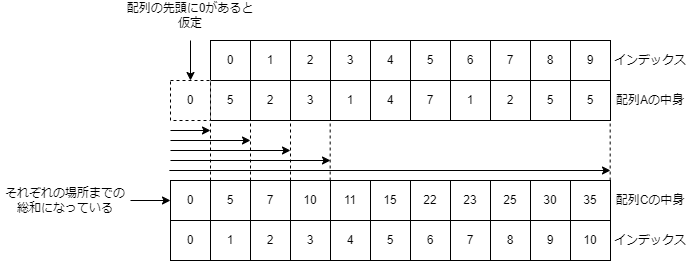

# 累積和

## はじめに

次のような問題を考えてみます.

```
問題

長さNの配列AとQ個のクエリが与えられます.
それぞれのクエリについての答えを出力してください.

クエリの内容
整数L,Rが与えられるので，配列AのL番目からR番目までの要素の総和を求めてください.

入力
N Q
A_0 A_1 ・・・ A_N-1
L_0 R_0
L_1 R_1
.
.
.
L_Q-1 R_Q-1

制約
1<=N,Q<=2×10^5
1<=A_i<=1000
1<=L<=R<=N
```

入力例

```
10 3
5 2 3 1 4 7 1 2 5 5
2 9
5 9
1 10
```

出力例

```
25
19
35
```

この問題の入力例を考えてみます.

愚直にやろうとすれば2+3+1+4+7+1+2+5とすべて足していって答えを出すと思いますが，この方法だと計算量がO(N)となります.

与えられた範囲が1つだけの場合はこの愚直解でも通せますが，今回の問題のように何回も範囲が与えられる場合は計算量はO(NQ)となってしまい，大きくなってしまいます.

そこで使えるのが累積和です.

## 累積和の考え方

累積和とは，事前に配列の総和をO(N)で計算しておくことで，指定範囲内の配列の要素の総和をO(1)で処理できるアルゴリズムです.

何回も範囲の総和を求めるときに使えます.

### 前計算

まずは前計算として要素数N+1の新しい配列宣言し(ここでは新しく宣言した配列をCとします)，C_iにはAの前から1番目からi番目までの総和を格納します. ただし，Aの前から0番目には0が格納されていると仮定してC_0には0を格納しておきます.

例を出して説明すると，C_1にはA_0までの総和(A_0)，C_2にはA_1までの総和(A_0+A_1)，C_3にはA_2までの総和(A_0+A_1+A_2)，C_4にはA_3までの総和(A_0+A_1+A_2+A_3)格納されているといった感じです.




そして，i番目までの総和にi+1番目の要素を足すとi+1番目までの総和になることから，C_iにA_iを足すだけでC_i+1が求められます.　

例えばC_3(A_0+A_1+A_2)がわかっている場合，それにA_3を足すとC_4が求められます.

よって，C_iをそれぞれO(1)で求められるので，この前計算はO(N)で求められます.

実装例(前計算の部分だけ)

```cpp
 vector<int> C(N+1);

 C[0]=0;//C_0は0

 for(int i=0;i<N;i++){

    C[i+1]=C[i]+A[i];

 }
```

これで前計算は終わりです.次は実際に範囲の総和を求めてみましょう.

### 範囲の総和

[L,R]の範囲の総和を求めるときはC[R]-C[L-1]で求められます.

