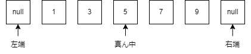
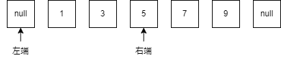
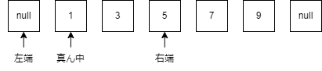
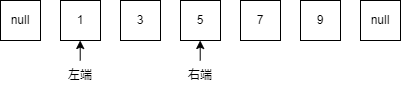
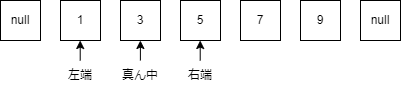
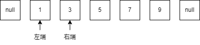
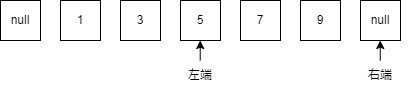
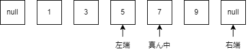
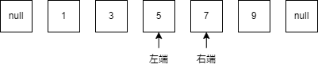

# アルゴリズム置き場

## はじめに

このページでの解説はすべてC++で行っています．そのため，他の言語を使用する人には少々わかりずらい箇所があるかもしれませんがご了承ください．

あとこのページに書いてあるコードは動作確認しておりません.

## STLコンテナクラスを用いた計算量削減(C++を扱う人向け)

この章は[APG4b AA - 3.03.STLのコンテナ](https://atcoder.jp/contests/apg4b/tasks/APG4b_aa)に書かれているコンテナの中から重要なコンテナを抜粋し，それらについての説明と応用をする章です．

### 連想配列(map)

連想配列はキーとなるある値を渡すとそれに対応した値を高速に返してくれるコンテナです．

例えばキーである「リンゴ」を言うと「100円」と返し，「みかん」と言うと「50円」って返してくれるような感じです．

宣言や値の格納，値の取り出しは以下のように行います．

```cpp
#include<map> //連想配列用のヘッダファイル
#include<iostream>
#include<string>
using namespace std;
int main(){

    map<string,int> mp; //map<キーの型,値の型> 変数名 で宣言

    mp["リンゴ"]=100; //格納するときは 変数名[キー]=値
    mp["みかん"]=50;

    cout<<mp["リンゴ"]<<endl; //取り出すときは 変数名[キー]
    cout<<mp["みかん"]<<endl;


    return 0;
}
```

実行結果
```cpp
100
50
```

C++の連想配列には重要な性質として次のような性質があります．

1. 初期値は0である

2. キーは重複して登録することは出来ない．

3. 配列の中身はキーが小さい順に並んでいる．

そのため，連想配列は次のような問題に強いです．

- 要素数え上げ

- 配列内の最大最小問題

- 重複検知

ここからは連想配列を用いてさっきの3つの問題について考えていきます．

```
例題1 要素数え上げ

要素数Nの整数列aが与えられます．
その後，整数xが与えられるので，xが配列vの中に何個あったかを出力しなさい．
ただし，xはQ個与えられるので，それぞれの出力を1行ごとに出力しなさい．

入力
N
a_0 a_1 ... a_n-1
Q
x_0
x_1
...
x_n

制約
N,Q<=2*10^5
a_i,x_i<=10^9
入力はすべて正の整数
実行制限時間 2sec

入力例1
5
1 2 1 3 1
3
1
2
3

出力
3
1
1


入力例2
5
1 1 1 1 1
3
1
5
10

出力
5
0
0
```

この問題を愚直に配列操作だけで行おうとするとO(NQ)もかかってしまい，実行制限時間に間に合いません．

そこで連想配列を用いて高速化を行います．

連想配列のキーに配列内の要素を，値にその数が何回出てきたかを格納しておくと，最初の格納でO(NlogN)，1つのクエリにつきO(logN)で処理できるので，全体の計算量としてはO(NlogN)となり，実行制限時間に間に合います．

以下は実装例です．

```cpp
#include<iostream>
#include<vector>
#include<map>
using namespace std;
int main(){
    int N,Q,x;
    cin>>N;
    vector<int> a(N);
    for(int i=0;i<N;i++){
        cin>>a[i];
    }

    map<int,int> mp;

    for(int i=0;i<N;i++){
        mp[a[i]]++; //インクリメントでa[i]が出てきた回数を1増やす
    }

    cin>>Q;
    
    for(int i=0;i<Q;i++){
        cin>>x;
        cout<<mp[x]<<endl;
    }
    return 0;
}
```

## 二分探索

次のような問題を考えてみます.

```
例題
要素数Nの配列vが与えられます．
次にQ個のクエリが与えられるので，それぞれのクエリについて出力しなさい．

クエリは整数xで与えられるので，配列vについてx以上の値の中で最も小さい要素を出力しなさい．
ただし，そのような要素が存在しない場合，-1を出力しなさい．

入力
N
v_0 v_1 ... v_N-1
Q
x_0
x_1
...
x_Q-1

制約
N,Q<=2×10^5
v_i,x_i<=10^9
入力はすべて正の整数
```
```
入力例1
5
1 3 5 7 9
3
3
6
10

出力
3
7
-1
```
```
入力例2
7
9 3 4 1 7 8 10
5
1
2
3
4
5

出力
1
3
3
4
7
```
これを愚直に実装しようとするとO(NQ)かかり，実行時間がとても大きくなってしまいます.

しかし二分探索というアルゴリズムを用いればO(QlogN)で行うことが可能です.

この問題を次のように考えます．

```
数が小さい順に並んでいる配列において，答えの下限である右端と上限である左端を決めた時に，右端と左端の真ん中の値は条件に合っているか
```
とは言ってもこれを見ただけでは何のことかさっぱりわからないと思うので，例を挙げながら解説していきます．

入力例1の1つ目のクエリ(x=3)を例とします．

問題文より，答えになる値の条件は以下の通りです．

```
x以上である
```

この条件に当てはまる時，その値は答えになる可能性があります．

これを踏まえた上で実際に動きを追ってみましょう．



ここでの右端は条件を満たすと分かっている値の中で最小の要素の場所を，左端は条件を満たさないと分かっているものの中で最大の要素の場所を指しています．

始めは，右端，左端ともに分かっている値が無いので，左端は配列の左外(-1の場所)に，右端は配列の右外(Nの場所)に設定しておきます．

今回の一行目のクエリではx=3であり，この時真ん中の値である5は条件に当てはまる(x以上)なので，答えは少なくとも5よりも右側には存在しないことが分かります．

なので, 答えの上限である右端を真ん中まで持っていきます．



<!-- この時点で右半分に存在する要素が答えになる可能性を取り払えたので，答えになる可能性がある要素の数は最初に比べて半分のN/2個になりました． -->

次にまた真ん中の値を見ます．



今回の真ん中の値である1は条件に当てはまらない(x以上ではない)ことから，答えは1から左には存在しないことが分かるので，左端を真ん中まで持っていきます．



<!-- この時点での操作でも一つ前の要素の数に比べて半分になっています． -->

この操作を右端と左端の位置の差が1になる(真ん中を選べなくなる)まで繰り返します．







右端と左端の位置の差が1(真ん中が選べない状態)になったので探索を終了します．

この時の右端が答えを満たす最小の数，左端が答えを満たさない最大の数になります．

よって一つ目のクエリの答えは3です．

二つ目のクエリ(x=6)でも動きを見てみましょう．


この時，真ん中の値である5は条件に当てはまらないので, 左端を真ん中まで持っていきます．





7は条件に当てはまるので，右端を真ん中に持っていきます．



ここで右端の位置と左端の位置の差が1になったので探索を終了します．

この時点での右端がさしている場所の要素が答えとなるので，答えは7になります．

ここまでの流れを整理してみます．

1. 配列を小さい順にソートする．

2. 答えとなる条件式を立てる．

3. 右端と左端を設定する．

4. 真ん中の値が条件式に当てはまるかどうかを確認する．

5. もし当てはまれば右端を真ん中の位置に，当てはまらなければ左端を真ん中の位置に持ってくる．

6. 4,5の操作を右端と左端の位置の差が1になるまで繰り返す．

これを踏まえたうえで，ここからは実際に実装してみます.

```cpp
#include<bits/stdc++.h>
using namespace std;
int main(){

    //以下標準入力
    int N;
    cin>>N;
    vector<int> v(N);
    for(int i=0;i<N;i++){
        cin>>v[i];
    }
    int Q;
    cin>>Q;
    vector<int> x(Q);
    for(int i=0;i<Q;i++){
        cin>>x[i];
    }
    //ここまで

    return 0;
}
```

さっきの流れに沿って実装していきます.

1. 配列を小さい順にソートする．

ソートはstd::sortを使うことで行うことができます.

```cpp
    sort(v.begin(),v.end()); //1. 配列を小さい順にソートする
```

2. 答えとなる条件式を立てる．

条件式は正しいかどうかをboolで返すとよいので，次のような判定用の関数を宣言します.

```cpp
//2. 条件式を立てる
// aがx以上ならばtrueを返す
bool isok(int x,int a){
    return a>=x;
}
```

今回の場合はx以上であれば答えになる可能性があるのでこのような関数にしましたが，二分探索の条件が必ずしもこのような条件であるとは限らないので，その場に応じた条件式を自分で立てて，この関数の中に書いてください.

3. 右端と左端を設定する．

今回は右端をright，左端をleftとしています.

また，ついでに真ん中の位置を記憶しておく変数もmidとして宣言しておきます.

```cpp
    sort(v.begin(),v.end()); //1. 配列を小さい順にソートする

    int right=N,left=-1,mid; //3. 右端と左端を設定する
```

右端の初期値は-1，左端の初期値は配列の大きさ(今回の場合はN)にしてください.

4. 真ん中の値が条件式に当てはまるかどうかを確認する．

真ん中の位置は右端と左端の平均をとるとわかります.

また，条件式に当てはまるかどうかはさっき宣言した条件式の返り値を見るとわかります.

```cpp
    sort(v.begin(),v.end()); //1. 配列を小さい順にソートする

    int right=N,left=-1,mid; //3. 右端と左端を設定する

    //4. 真ん中の値が条件式に当てはまるかどうかを確認する．
    mid=(left+right)/2;

    if(isok(x[i],v[mid])){ //もし真ん中の値(v[mid])が条件式に当てはまるならば

    }
    else{ //当てはまらなければ

    }
```

5. もし当てはまれば右端を真ん中の位置に，当てはまらなければ左端を真ん中の位置に持ってくる．

leftやrightにmidを代入します.

```cpp
    sort(v.begin(),v.end()); //1. 配列を小さい順にソートする

    int right=N,left=-1,mid; //3. 右端と左端を設定する

    //4. 真ん中の値が条件式に当てはまるかどうかを確認する．
    mid=(left+right)/2;

    if(isok(x[i],v[mid])){ //もし真ん中の値(v[mid])が条件式に当てはまるならば

        right=mid;//5. 右端を真ん中の位置に持ってくる

    }
    else{ //当てはまらなければ

        left=mid;//5.左端を真ん中の位置に持ってくる

    }
```

6. 4,5の操作を右端と左端の位置の差が1になるまで繰り返す．

4と5の部分をfor文やwhile文で条件を満たすまでループさせます.

```cpp
    sort(v.begin(),v.end()); //1. 配列を小さい順にソートする

    int right=N,left=-1,mid; //3. 右端と左端を設定する

    while((right-left)>1){ //6. 4,5の操作を右端と左端の位置の差が1になるまで繰り返す．

        //4. 真ん中の値が条件式に当てはまるかどうかを確認する．
        mid=(left+right)/2;
        if(isok(x[i],v[mid])){ //もし真ん中の値(v[mid])が条件式に当てはまるならば

            right=mid;//5. 右端を真ん中の位置に持ってくる

        }
        else{ //当てはまらなければ

            left=mid;;//5.左端を真ん中の位置に持ってくる

        }
    }
```

これで二分探索の実装ができました.

ループを抜けたときのrightの位置が条件を満たす最小の値で，leftの値が条件を満たさない最大の値です.

最後に今回の例題の実装例です.

```cpp
#include<bits/stdc++.h>
using namespace std;

//2. 条件式を立てる
// aがx以上ならばtrueを返す
bool isok(int x,int a){
    return a>=x;
}

int main(){

    //以下標準入力
    int N;
    cin>>N;
    vector<int> v(N);
    for(int i=0;i<N;i++){
        cin>>v[i];
    }
    int Q;
    cin>>Q;
    vector<int> x(Q);
    for(int i=0;i<Q;i++){
        cin>>x[i];
    }
    //ここまで


    //以下二分探索の実装
    sort(v.begin(),v.end()); //1. 配列を小さい順にソートする

    for(int i=0;i<Q;i++){ //入力の数だけ繰り返す

        int right=N,left=-1,mid; //3. 右端と左端を設定する

        while((right-left)>1){ //6. 4,5の操作を右端と左端の位置の差が1になるまで繰り返す．

            //4. 真ん中の値が条件式に当てはまるかどうかを確認する．
            mid=(left+right)/2;
            if(isok(x[i],v[mid])){ //もし真ん中の値(v[mid])が条件式に当てはまるならば

                right=mid;//5. 右端を真ん中の位置に持ってくる

            }
            else{ //当てはまらなければ

                left=mid;//5.左端を真ん中の位置に持ってくる

            }
        }

        if(right==N){ //  条件を満たすものがなかった時
            cout<<-1<<endl;
        }
        else{
            cout<<v[right]<<endl; //答えを出力
        }

    }
    return 0;
}
```

## 深さ優先探索(DFS)

[あっとこ](https://atcoder.jp/contests/atc001/tasks/dfs_a)に書いてます．

## 幅優先探索(BFS)

各枝のコストが1のグラフにおいての最短経路問題にすごい向いている

## ダイクストラ法

BFSの汎用性すごいやつ

priority_queueを使ったらいける

## UnionFind

要素をグループ分けしたり，グラフのサイクル検知に使えるやつ

割と使うらしい(僕はまだ一回しか使ったことない)

## 累積和

範囲内の総和を爆速で求められる

## imos法

指定範囲内に何かを足したり引いたりするのを爆速で行える

## 動的計画法

考え方を習得するまではくっそむっずいやつ

でも競プロではほぼ毎回出てくるぐらい常連の典型アルゴリズム

## ランレングス圧縮

文字列に対して行うアルゴリズムで，文字が出てきた順番に何個連続で出現したかを格納した配列を返す．

## エラトステネスの篩

N以下の素数を高速に求めることができるアルゴリズム

素数を小さい物から順に求めて，その素数の倍数を全て消していくと言った方法で素数を求めていく

## 高速素因数分解

前計算としてそれぞれの数の最小の素因数を求めておくことで，求めたい値の素因数を求める時も最小の素因数の配列を参照することで再帰的に素因数分解を行うことができるアルゴリズム

## ニュートン法

「ある関数f(x)について，ある点x_0での接線のx切片をx_1とした時，x_1はx_0よりもf(x)=0となるxの値に近い」という法則を用いて，近似値を高速で求めることができるアルゴリズム

## ユークリッドの互除法

2数a,bの最大公約数を高速で求めることができるアルゴリズム

## 包除原理

処理が重いORの問題を処理が軽いANDと足し算の計算に直す考え方

