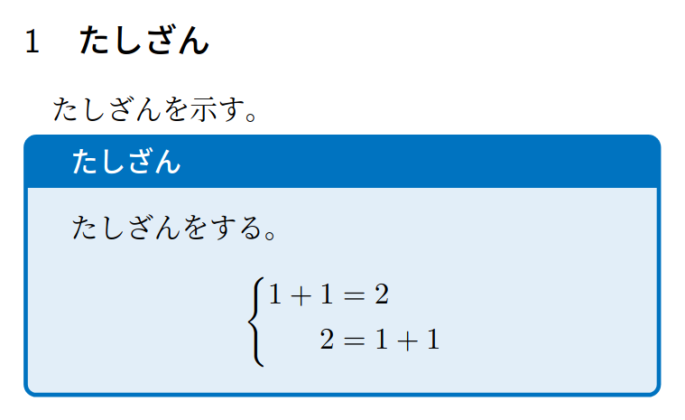

# LaTeXで色付き枠使って見た目をよくしよう

## 概要

テスト用資料の作成でいろいろ試したので書いてみる

## 色付き枠を使ってみよう

早速ですが、これを試してみましょう。

```tex
\documentclass[twocolumn, a4paper]{ltjsarticle}

\usepackage[dvipsnames]{xcolor} % 色の名前を拡張
\usepackage{tcolorbox} % 枠本体
\tcbuselibrary{raster,skins,breakable,theorems} % 呪文

\newenvironment{qbox}[1]{ % qbox環境を定義して使いやすく
    \begin{tcolorbox}[
        colframe = RoyalBlue,
        colback = RoyalBlue!10!White,
        title = {#1},
        fonttitle = \bfseries,
        breakable = true
    ]
}{
    \end{tcolorbox}
}

\begin{document}

\section{たしざん}
たしざんを示す。
\begin{qbox}{たしざん}
    たしざんをする。
    {
        \begin{equation*}
            \Biggl\lbrace
            \begin{alignedat}{2}
                1+1 &= 2 \\
                2 &= 1+1
            \end{alignedat}
        \end{equation*}
    }
\end{qbox}

\end{document}
```

すると、こんなものができる。



続きはまた書く


## 参考文献
 - [tcolorboxの基本](https://texmedicine.hatenadiary.jp/entry/2015/12/17/000339)
 - [tcolorboxのお誘い](https://marukunalufd0123.hatenablog.com/entry/2019/03/15/071717)