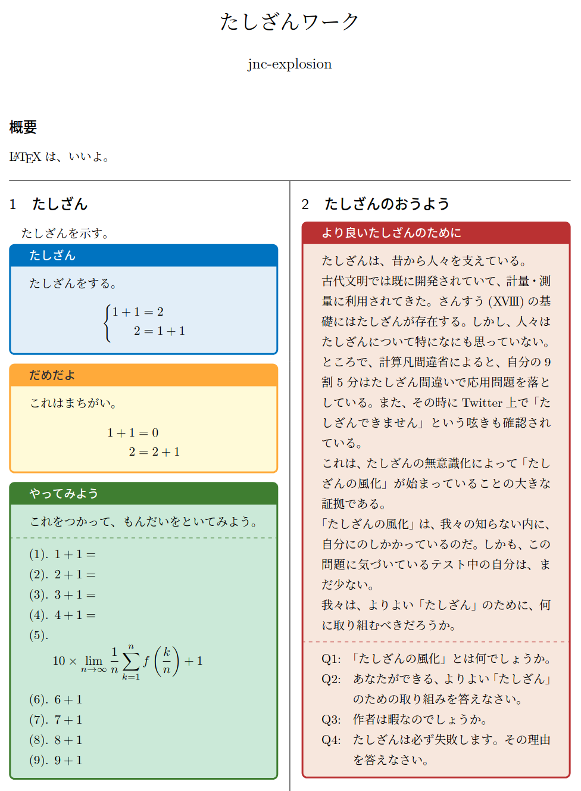

# LaTeXで色付き枠使って見た目をよくしよう

## 概要

テスト用資料の作成でいろいろ試したので書いてみる

## 色付き枠を使ってみよう

早速ですが、これを試してみましょう。

```tex
\documentclass[twocolumn, a4paper]{ltjsarticle}

\usepackage[dvipsnames]{xcolor} % 色の名前を拡張
\usepackage{tcolorbox} % 枠本体
\tcbuselibrary{raster,skins,breakable,theorems} % 呪文

\newenvironment{qbox}[1]{ % qbox環境を定義して使いやすく
    \begin{tcolorbox}[
        colframe = RoyalBlue,
        colback = RoyalBlue!10!White,
        title = {#1},
        fonttitle = \bfseries,
        breakable = true
    ]
}{
    \end{tcolorbox}
}

\begin{document}

\section{たしざん}
たしざんを示す。
\begin{qbox}{たしざん}
    たしざんをする。
    \begin{equation*}
        \Biggl\lbrace
        \begin{alignedat}{2}
            1+1 &= 2 \\
            2 &= 1+1
        \end{alignedat}
    \end{equation*}
\end{qbox}

\end{document}

```

すると、こんなものができます。


めちゃくちゃ見た目が良い枠が生成されました。`itembox`とは比べものにならない、鮮やかなカラーを持っていますね。

しかも、色や形も変えることができます。これも試してみましょう。

```tex
\documentclass[twocolumn, a4paper]{ltjsarticle}

\usepackage[dvipsnames]{xcolor} % 色の名前を拡張
\usepackage{tcolorbox} % 枠本体
\tcbuselibrary{raster,skins,breakable,theorems} % 呪文

\newenvironment{qbox}[1]{ % qbox環境を定義して使いやすく
    \begin{tcolorbox}[
        colframe = RoyalBlue,
        colback = RoyalBlue!10!White,
        title = {#1},
        fonttitle = \bfseries,
        breakable = true
    ]
}{
    \end{tcolorbox}
}
\newenvironment{warnbox}[1]{ % warnbox環境を新しく定義する
    \begin{tcolorbox}[
        colframe = Yellow!40!Orange,
        colback = Yellow!20!White,
        title = {#1},
        fonttitle = \color{Black} \bfseries,
        breakable = true
    ]
}{
    \end{tcolorbox}
}

\begin{document}

\section{たしざん}
たしざんを示す。
\begin{qbox}{たしざん}
    たしざんをする。
    \begin{equation*}
        \Biggl\lbrace
        \begin{alignedat}{2}
            1+1 &= 2 \
            2 &= 1+1
        \end{alignedat}
    \end{equation*}

\end{qbox}

\begin{warnbox}{だめだよ}
    これはまちがい。
    \begin{alignat*}
        1+1 &= 0 \\
        2 &= 2+1
    \end{alignat*}
\end{warnbox}

\end{document}

```

これで、こんな感じになります。


これらを組み合せていくと、こんな資料が作れます。



カラフルな文章ですね。内容がやばすぎて例になっていませんが。

このように、色を分けることによって、**その文章が何を意味するのかを明確に伝えやすくなります。**(「定義」とか「注意」とか)
また、見た目が良いので歓声を受けることもできるかもしれません。

今日からあなたも、tcolorboxでカラフル枠生活を始めてみませんか？

## あとがき

深夜に仕上げたので内容がハムより薄い

そのうちちゃんと書く

## 参考文献

以下の3サイトを参考にさせて頂きました。ありがとうございます。

 - [tcolorboxの基本](https://texmedicine.hatenadiary.jp/entry/2015/12/17/000339)
 - [tcolorboxのお誘い](https://marukunalufd0123.hatenablog.com/entry/2019/03/15/071717)
 - [【LaTeX】文字の色を変える方法](https://mathlandscape.com/latex-color/)